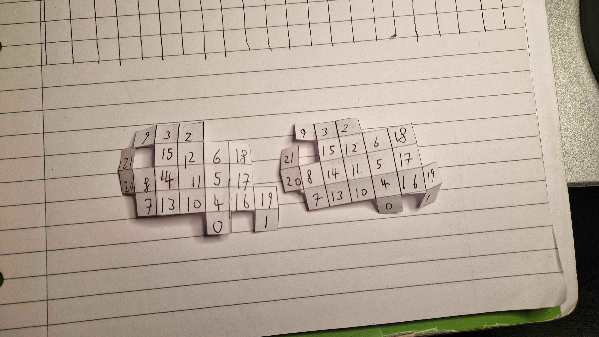
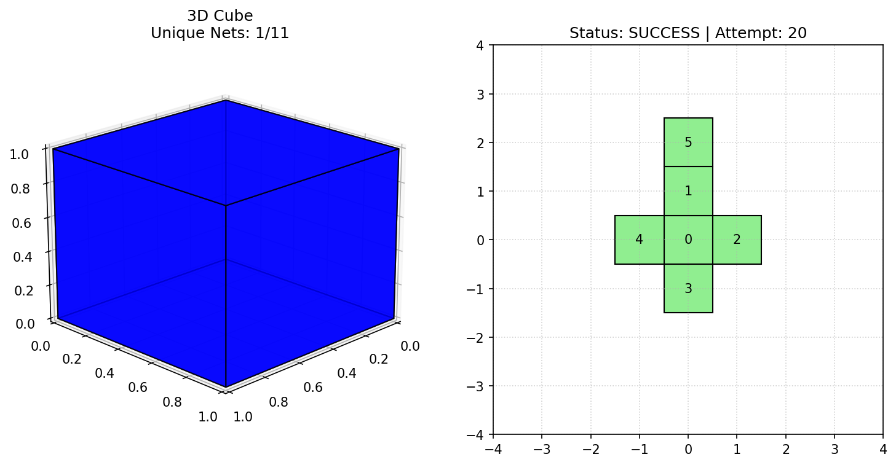
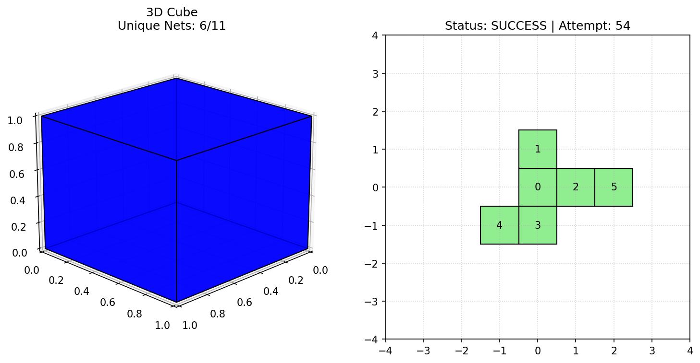
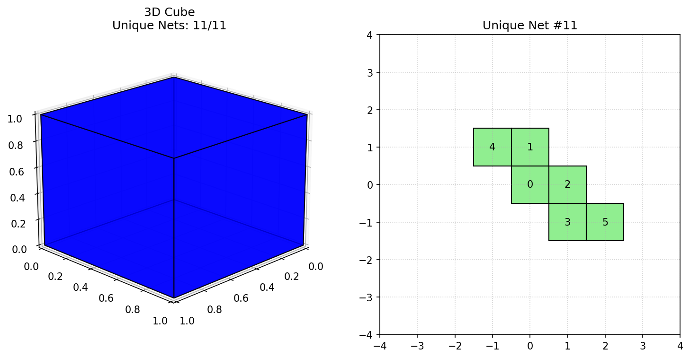

# Trying to find the world's first polyomino net that folds into 4 incongruent orthogonal boxes

the main goal of this project is to find a single 2d polyomino net that can fold into 4 totally unique (incongruent) 3d boxes.

we already know it's possible for a net to fold into 2 or even 3 different boxes. here is an example I found of a net that folds into 2 boxes:

but scaling this up to finding 4 boxes is a massive computational challenge. the project is broken down into three main components:

1. finding surface area quartets
   first we need to find 4 unique boxes that all share the exact same surface area, because they cant share a net if the areas are different. I wrote a python script that mathematically brute forces and filters these quartets.

2. the net generator
   it takes a 3d box and generates every single valid 2d net for it. it treats the box surface as a graph and uses a depth first search to build the net square by square. it tracks the 3d to 2d coordinate rotations and backtracks if the paper overlaps itself. we are implementing redelmeier's algorithm to stop it from wasting time checking the exact same net built in a different order.

3. the matcher
   once the generator is fast enough to scale to bigger boxes, this component will take the millions of generated nets from a quartet of boxes and cross reference them to find a single shared shape.

this process however, will never work within our lives, so I am currently working on finding patterns to narrow the search space. And better algorithms like hill climbing so we dont try searching every possibility.

here is the net generator proof of concept working on a standard 1x1x1 cube. it successfully finds all 11 known nets:

whats interesting is how fast this scales:
- a 1x1x1 has 11 unique nets
- 1x1x2 has 723
- 1x1x3 has 15057
- the smallest quartet of 4 boxes that have the same surface area and so can share a net would have maybe 100 quintillion unique nets based on a exponential approximation (altho combinatorial might be more accurate).